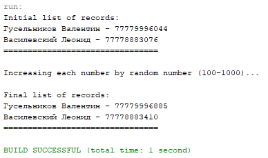

# GVS03_JDBC_SQL

Решение 2 задания, 3 вариант.



```
CREATE TABLE IF NOT EXISTS `my_phonebook` (
  `id` int(11) NOT NULL AUTO_INCREMENT,
  `name` varchar(50) NOT NULL,
  `number` varchar(11) NOT NULL,
  PRIMARY KEY (`id`)
) ENGINE=InnoDB DEFAULT CHARSET=utf8;

INSERT INTO my_phonebook (name, number) VALUES ("Гусельников Валентин", "77779994433");
INSERT INTO my_phonebook (name, number) VALUES ("Василевский Леонид", "77778881122");
```
